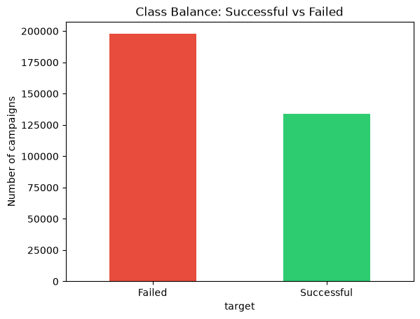
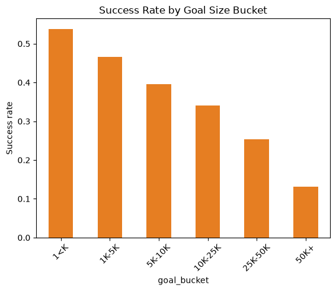
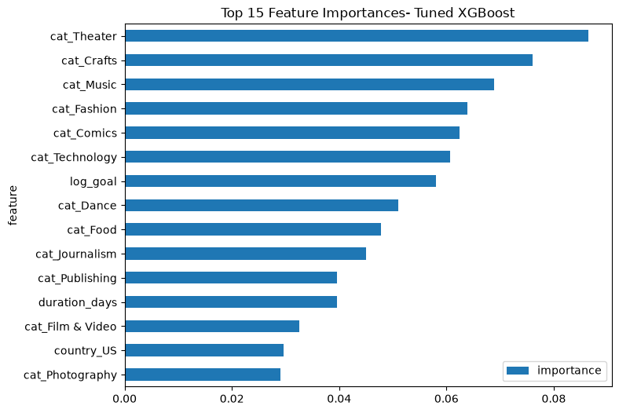
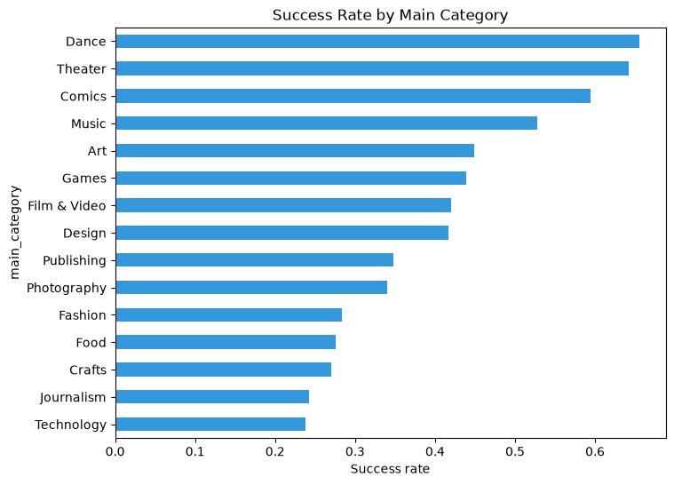
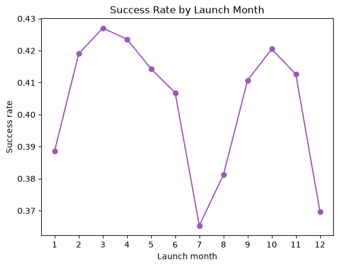

# WillItFund

A machine learning model that predicts whether a Kickstarter campaign will succeed using only **pre-launch attributes** — with a focus on handling severe class imbalance and identifying which factors actually drive funding outcomes.

## The question

Given only what's knowable *before* a campaign launches — funding goal, category, duration, launch timing, and title characteristics — can we predict whether it will succeed or fail? And what actually drives that outcome?

This deliberately excludes anything that only becomes known *after* launch (backer count, pledged amount, momentum) — the goal is a decision-support tool a creator could use before going live, not a model that "predicts" outcomes it's secretly been told the answer to.

## Data

- **Source:** [Kickstarter Projects](https://www.kaggle.com/datasets/kemical/kickstarter-projects) (Mickaël Mouillé, Kaggle, CC BY-NC-SA 4.0) — 378,661 campaigns, 15+ fields including goal, category, country, currency, dates, and outcome state.
- **Target definition:** Kept only `successful` (1) and `failed` (0) campaigns. Dropped `live` (no outcome yet), `canceled`/`suspended` (ambiguous — could reflect either an already-failing campaign or an unrelated withdrawal), and `undefined` (data quality issue). This is a modeling judgment call, not an objective fact, and other reasonable definitions exist.
- **Class balance:** 59.6% failed / 40.4% successful — a real but moderate imbalance, addressed via class weighting (see Modeling).

### Data cleaning
- Removed 210 rows with a corrupted `country` field (`'N,0"'`), a known data quality issue in this dataset.
- Removed 92 rows with campaign durations outside Kickstarter's actual platform rules (0 days, or over the 60-day maximum) — clear data errors.
- Final cleaned dataset: **327,234 rows.**

## Exploratory findings



The target is moderately imbalanced — 59.6% failed, 40.4% successful — which shapes every modeling decision that follows.

- **Goal size is a strong, near-monotonic predictor of success** — success rate drops steadily from 53.8% (goals under $1K) to 13.1% (goals over $50K).



- **Category matters substantially** — performance-based categories (Dance: 65.6%, Theater: 64.2%) far outperform technical/investigative categories (Technology: 23.8%, Journalism: 24.2%), likely reflecting a mix of typical goal size differences and backer trust dynamics per category.



- **Goal amounts cluster heavily at round numbers** ($5K, $10K, $15K, etc.) — a real behavioral pattern showing creators anchor to round figures rather than calculating precise costs.



- **Mild seasonality** — success rates dip in July (36.5%) and December (37.0%), likely due to reduced backer attention during summer and the holidays, and peak in March (42.7%) and October (42.1%).



## Features

**Numeric:** log-transformed goal (`log_goal`, to correct heavy right-skew), campaign duration in days, launch month, title character length, launch day of week.

**Behavioral/text-derived:** whether the title contains a question mark, whether it contains a number.

**Categorical (one-hot encoded):** main category (14 categories), country (22 countries after cleaning).

**Deliberately excluded:** `backers` and `pledged` amount — these are only known *after* a campaign has already run, and including them would leak future information into a model meant to predict outcomes before launch.

## Modeling

| Model | Accuracy | Precision | Recall | F1 |
|---|---|---|---|---|
| Logistic Regression (baseline) | 65.4% | 60.1% | 43.1% | 0.502 |
| Random Forest | 65.2% | 58.2% | 49.5% | 0.535 |
| XGBoost | 67.5% | 61.8% | 51.1% | 0.559 |
| XGBoost + class weighting | 66.1% | 56.6% | 68.9% | 0.621 |
| XGBoost + class weighting + tuning (final) | 66.3%* | 56.4% | 69.5% | **0.623** |

*Accuracy shown for the final tuned model; precision/recall/F1 are the values that mattered most for model selection given the class imbalance.

**Why accuracy isn't the headline metric:** a model that always predicts "failed" would already score 59.6% accuracy without learning anything. Precision, recall, and F1 give a far more honest picture — especially recall, since the cost of missing a genuinely fundable campaign (telling a creator "you'll likely fail" when they'd have succeeded) is arguably worse than the reverse.

**Class weighting was the single biggest lever**, not model tuning — applying `scale_pos_weight` to XGBoost raised recall from 51.1% to 68.9% (a ~18-point gain) at a real cost to precision (61.8% → 56.6%), improving F1 from 0.559 to 0.621. Subsequent hyperparameter tuning (grid search over `max_depth`, `n_estimators`, `learning_rate`) yielded only a marginal further gain (F1: 0.621 → 0.623), suggesting XGBoost's defaults were already close to well-suited for this problem.

**Final model:** XGBoost, `max_depth=5, n_estimators=200, learning_rate=0.1`, with class weighting (`scale_pos_weight≈1.47`).

**Cross-technique confirmation:** the logistic regression baseline's coefficients independently reproduced the same category and goal-size patterns found through pure EDA — Dance (+0.96) and Theater (+0.86) had the strongest positive coefficients, while Crafts (-0.88) and Journalism (-0.79) had the strongest negative ones, matching the category success-rate ranking exactly, and `log_goal` carried a negative coefficient as expected. Two independent methods (groupby aggregation and multivariate regression) agreeing is a real piece of evidence that these patterns reflect genuine signal rather than noise.

**Random Forest vs. logistic regression:** switching from logistic regression to Random Forest raised recall from 43.1% to 49.5% (a 6.4-point gain) with only a small precision tradeoff (60.1% → 58.2%), improving F1 from 0.502 to 0.535. This suggests nonlinear feature interactions — e.g., goal size combined with category — carry meaningful signal that a linear decision boundary misses.

## Feature importance


Category-related features dominate the top of the importance ranking (Theater, Crafts, Music, Fashion, Comics, Technology), with `log_goal` ranking 7th. This differs somewhat from the logistic regression coefficients, where goal size and category showed more comparable influence — tree-based importance reflects how useful a feature is for splitting data across many trees, not a single linear effect size. Note that high importance doesn't imply a *positive* effect: Crafts and Technology are highly informative despite being associated with lower success rates, consistent with the EDA findings above.

## Limitations

- **Pre-launch features only, by design** — this model cannot capture marketing push, early backer momentum, social virality, or creator reputation, all of which likely matter a great deal in reality. Even a "perfect" model within this feature scope has a real ceiling.
- **Target definition is a judgment call** — canceled/suspended campaigns were excluded rather than treated as failures; a different choice here would change the results.
- **Correlation, not causation** — findings like "smaller goals succeed more" describe association, not a proven causal mechanism. It's plausible that creators who set realistic goals are already better-prepared campaigners, rather than the goal size itself driving the outcome.
- **Country effects may be confounded** — some countries showing higher/lower success rates may partly reflect differing category or goal-size mixes by country rather than a standalone country effect.

## Tech stack

Python, pandas, NumPy, scikit-learn, XGBoost, matplotlib

## Project structure

```
WillItFund/
├── data/              (raw CSV — not committed, see below)
├── notebooks/         (exploration, cleaning, modeling)
├── plots/             (saved figures)
├── requirements.txt
└── README.md
```

**To reproduce:** download `ks-projects-201801.csv` from [Kaggle](https://www.kaggle.com/datasets/kemical/kickstarter-projects) into `data/`, then run the notebooks in order.